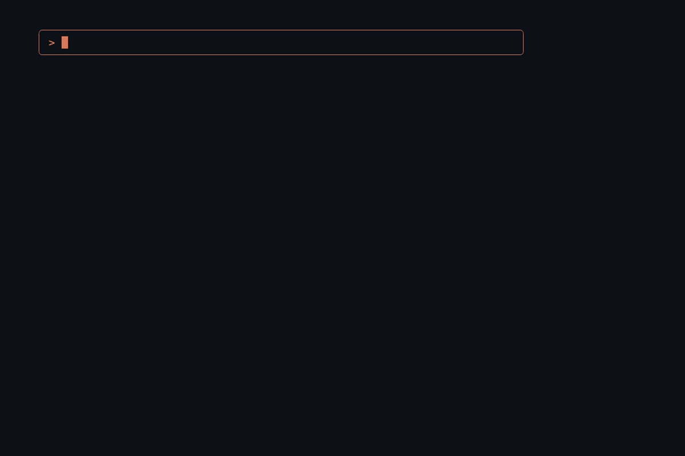

# What did I ship today?

> One command turns a day of Claude Code sessions into a recap you can share with a peer or save to your journal.

[](LICENSE)
&nbsp;[](https://docs.claude.com/en/docs/claude-code)
&nbsp;[](CHANGELOG.md)



`/wdist` reads every Claude Code session you ran — across every project — works out what actually shipped, and writes you a tight, share-ready recap. Short by default (a few bullets you can drop in a DM); pass `--verbose` for the full report.

- 🚢 **Knows what shipped.** Each item is tagged `(merged)` / `(PR open)` / `(CI failed)` by reading the PRs **you** authored and the releases **you** cut — so the recap answers *did it ship?*, not just *what did I touch?*
- 📆 **Any span, not just today.** `/wdist last week`, `/wdist last month`, `/wdist 2026-05-05 to 2026-05-10`.
- 🧠 **History goes back months.** Ranges past Claude Code's ~30-day transcript cleanup are rebuilt from its long-lived prompt log plus live GitHub state.
- 🔒 **Nothing leaves your machine.** It reads local transcripts and writes a markdown file. You copy and paste — no telemetry, no network calls beyond the GitHub CLI you already trust.

Delivery state needs the GitHub CLI (`gh`); everything degrades gracefully without it. See the [CHANGELOG](CHANGELOG.md) for what landed in each release.

## Install

```
/plugin marketplace add oksr/wdist
/plugin install wdist@wdist
/reload-plugins
```

Restart Claude Code if the command doesn't show up immediately after /reload-plugins.

## See it in action

Run `/wdist` at the end of the day and Claude reads every session you ran today (across every project), groups them by outcome, and produces something shaped like this (fictional example):

```
*What I shipped — 2026-04-15 (Wednesday)*
Mostly cart-checkout work — tax calculator and address-form fixes landed, payment SDK unblocked for mobile. *2 merged, 1 in review.*

• *Tax calculator v2* (merged) — handles the EU VAT cases the old lookup rounded wrong.
• *Address form regression* (merged) — Safari autocomplete was eating the first character.
• *Payment SDK upgrade unblocked for mobile* (PR open) — migration notes published, mobile can pick up 4.x.

_In progress:_ checkout funnel A/B — variant assignment isn't reading the cookie correctly yet.
```

Run `/wdist --verbose` for the full structured report (TL;DR, Shipped / In progress / Notes & followups sections, session footer):

```markdown
# What I shipped on 2026-04-15 (Wednesday)

**TL;DR:** Mostly cart-checkout work - landed the new tax calculator,
fixed two regressions in the address form, and unblocked the mobile team
on the payment SDK upgrade.

## Shipped

- **Tax calculator v2** (merged) - committed `1a2b3c4`; replaces the legacy
  rate-table lookup with the new vendor SDK. Handles the EU VAT cases the
  old one was rounding wrong.
- **Address form regression fix** (merged) - PR #482, the autocomplete dropdown
  was eating the first character on Safari.
- **Payment SDK upgrade unblocked for mobile** - published the migration
  notes to the team wiki; mobile can pick up `4.x` now.

## In progress

- **Checkout funnel A/B** (PR open) - wiring still mid-flight; test harness done
  but the variant assignment isn't reading the cookie correctly yet.

## Notes & followups

- We're still seeing the duplicate-charge edge case on stripe webhook
  retries; not a regression but worth a focused session.

---

_7 Claude Code sessions across `web` and `mobile`._
```

Pass a range — `/wdist last week`, `/wdist last month`, or an explicit `2026-05-26 to 2026-05-30` — and the recap collapses the whole span into themes (a thread that ran Mon–Thu is one bullet, not four), splits *Shipped* from *Still moving*, and leads with the delivery tally (fictional example):

```
*What I shipped — week of May 26–30*
Checkout was the through-line — funnel A/B shipped, payments and tax landed, plus address-form cleanup. *6 merged, 2 in review, 1 released.*

*Shipped*
• *Checkout funnel A/B* (merged) — cookie-based variant assignment fixed; live to 10%.
• *Tax calculator v2* (released) — EU VAT rounding fixed; cut `v2.1.0` Wednesday.
• *Payment SDK 4.x upgrade* (merged) — mobile unblocked, migration notes published.
• *Address-form regressions* (merged) — Safari autocomplete + paste-handling — web.

*Still moving*
• *Saved-cards redesign* (PR open) — UI done, waiting on a design review.
• *Webhook retry dedupe* (CI failed) — duplicate-charge edge case; retry suite still red.
_+ 5 smaller fixes across web and mobile._
```

`--verbose` renders the same span as a full themed report (Shipped / In progress / Notes, with PR numbers and commits). For long spans, the top themes lead and the routine tail rolls up into one line.

Output is also written to `~/claude-recaps/YYYY-MM-DD.md` (or `START_to_END.md` for a range) so you can copy it later without re-running.


## Usage

```
/wdist                            # short Slack-friendly recap of today
/wdist yesterday                  # natural-language relative dates
/wdist 2026-04-15                 # a specific date
/wdist last week                  # calendar-aligned ranges (also: this week, last month)
/wdist 2026-05-05 to 2026-05-10   # an explicit range
/wdist --verbose                  # full structured report (works with any of the above)
```

## Under the hood

Claude Code stores per-session JSONL transcripts at `~/.claude/projects/<encoded-cwd>/<session-id>.jsonl`. The plugin's extractor walks those files, filters to records with timestamps inside the target date (so continued multi-day sessions don't pollute the result), and emits a compact JSON document. The `/wdist` command then asks Claude to synthesize it into the format above.

The extractor is dependency-free Python 3 - no `pip install` needed.

Delivery state (PR + CI status and GitHub Releases) needs the GitHub CLI (`gh`) installed and authenticated, and queries only the PRs and releases **you** authored. Without `gh` — or for sessions in a non-GitHub repo — that signal is simply omitted and the recap falls back to local session activity, never erroring.

For multi-day ranges, wdist also reads Claude Code's long-lived prompt log (`~/.claude/history.jsonl`) to reconstruct days whose full transcripts have aged out — Claude Code deletes per-session transcripts older than `cleanupPeriodDays` (default 30 days). Reconstructed days are thinner: your prompts plus what shipped (from `gh`), without the full narrative. To retain more complete history going forward, raise `cleanupPeriodDays` in `~/.claude/settings.json`.

## Your data stays local

- **Read locally:** session titles, your prompts, Claude's final message per session, message counts, project paths.
- **Written locally:** `~/claude-recaps/YYYY-MM-DD.md`.
- **Sent anywhere:** nothing automatic. You copy and paste.

The synthesis prompt instructs Claude to redact obvious sensitive bits (ARNs, tenant URLs, customer IDs) before producing the markdown, but **review the output before sharing externally** - your sessions almost certainly contain things you don't want in a public Slack channel.

## Make it your own

The output format lives in `commands/wdist.md`. Edit the "Synthesize the recap" section to change tone, structure, or what counts as "shipped" vs. "in progress." The extractor is intentionally dumb - all the editorial logic is in the prompt.

## Staying current

To pull the latest version:

```
/plugin update wdist@wdist
```

Or open the `/plugin` UI and pick **Update now** on `wdist`.

To have new versions install automatically on Claude Code startup, open `/plugin` → **Marketplaces** → `wdist` → **Enable auto-update**. Auto-update is off by default for third-party marketplaces, so this is opt-in.

See [CHANGELOG.md](CHANGELOG.md) for what's new in each release.

## License

MIT - see [LICENSE](LICENSE).
